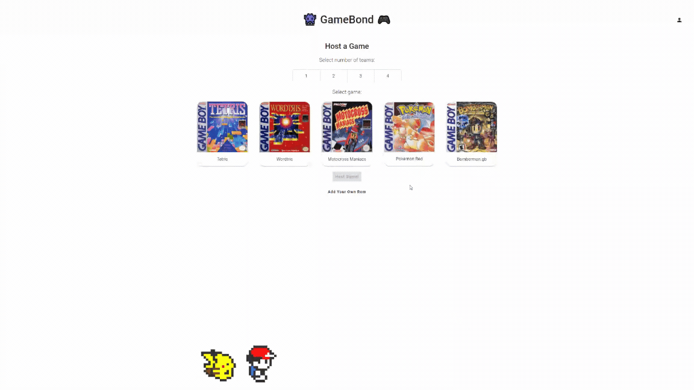
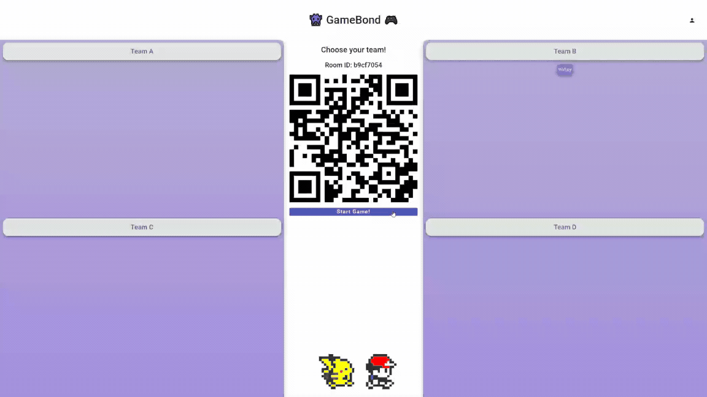

# GAMEBOND
Deployment: https://gamebond.up.railway.app/

## About
GameBond brings back the nolstalgia of playing co-op/competitive GameBoy with your friends, in the same room.

Bond over GameBoy = GameBond! 👾🎮

## How to Play
A host will start a game, and project their screen for a live audience.

The host can choose between 1-4 teams, and the game ROM to be played.

Once the lobby is set up, a QR code will appear on the screen for audiences to scan with their phones. The QR code will open up a Telegram bot, through which players can select the team they wish to join, and subsequently enter GameBoy inputs once the game starts.

Once the audience have joined their selected teams, the host can start the game. Players on the same team should work together to get the highest score versus other teams.

Enjoy!

## Use Cases
GameBond is best suited to be played in a live audience setting such as DnDs, weddings, team bonding events, etc.

## Requirements
Players need to have Telegram in order to join the games. *(Future development includes a web-based controller for players who do not have/wish to use Telegram)*

Host needs to have a projector, and a device (laptop or computer) to run the game. The game is best played on Google Chrome browser, and is optimized for 720p / 1080p / 1440p.

No installation required - just run it on browser!

## Membership Tiers
GameBond comes with 4 membership tiers:

| Tiers    | Price  | # Hosted Games Per Month | # ROMs in Account |
| :------- |:------:| :-----------------------:| :----------------:|
| Free     | S$0.00 |             5            |         5         |
| Lite     | S$2.99 |            20            |         8         |
| Standard | S$5.99 |            50            |         10        |
| Premium  | S$7.99 |           100            |         15        |

All accounts come with 4 default game ROMs loaded to the account. *(Future development includes ability to remove/disable ROMs from your account)*

## Contact Us
For any issues encountered when using GameBond, please contact us at business.gamebond@hotmail.com 

## Technology Used + Credits
- Backend Framework: Spring Boot

- Frontend Framework: Angular

- Databases: MySQL, Redis, S3

- Spring Boot Dependencies:

    | Dependencies  | Usage |
    | :------------ |:------|
    | Telegram Bot  | for players to join the games |
    | Mail          | for password resets |
    | Websocket     | for real-time communication between Angular and SpringBoot once game commences |
    | BCrypt        | for user passwords |
    | Stripe        | for membership subscriptions |

- Angular Libraries:

    | Libraries         | Usage |
    | :---------------- |:------|
    | GameBoy Emulator  | from https://www.npmjs.com/package/gameboy-emulator |
    | rx-stomp          | for websocket connection to Spring Boot |
    | Component Store   | for storing player messages when game commences (capped at 30 messages per team) |
    | Ng Materials      | for UI |
    | PWA               | for project requirements |

- External API calls made to https://goqr.me/api/doc/create-qr-code/

## Preview
Hosts can select the number of teams and game ROMs to play:

Audiences can join teams via a QR code and enter GameBoy commands for their team:

Players can input controls via the Telegram Bot:

